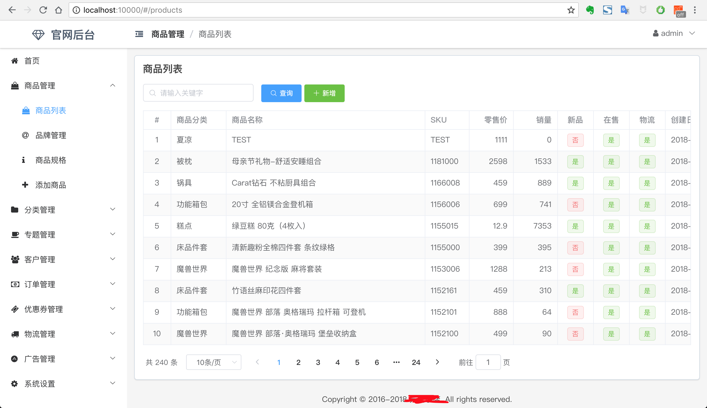
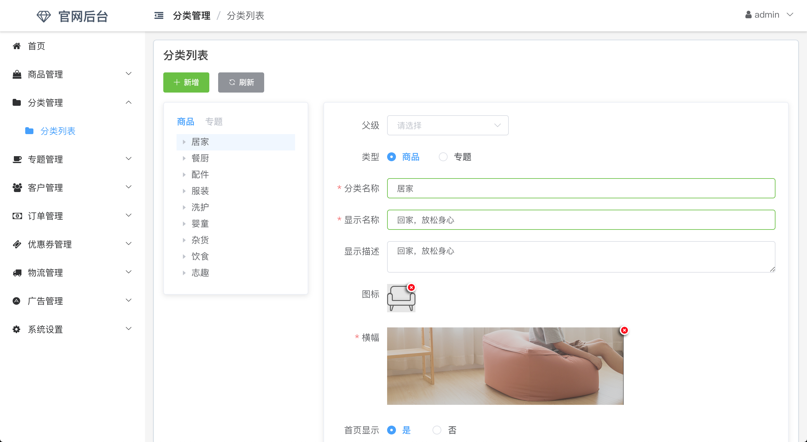
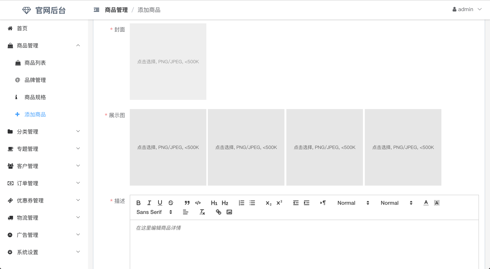

本项目为商城的管理界面，采用VUE+Element UI开发，目前大部分功能都开发完毕。


## 使用方法

1. 根据[nideshop_server_full](https://github.com/saonian/nideshop_server_full)的说明搭建好后端

2. 修改`config/index.js`下的proxyTable配置为后端接口API地址

3. 修改`src/api/index.js`里的七牛域名配置

4. 运行`npm install`安装依赖

5. 运行`npm run dev`启动项目

6. 使用`admin/jiafeimao`登录项目

### NideShop商城（nideshopApi服务端）

+ 界面高仿网易严选商城(主要是2016年wap版)
+ 测试数据采集自网易严选商城
+ 功能和数据库参考ecshop
+ 服务端api基于Ｎode.js+ThinkJS+MySQL
+ 计划添加基于Vue.js的后台管理系统、PC版、Ｗap版

本项目需要配合微信小程序端使用，GitHub: [https://github.com/tumobi/nideshop-mini-program](https://github.com/tumobi/nideshop-mini-program)

### 本地开发环境配置
```
+ 创建数据库nideshop并导入项目根目录下的nideshop.sql
```
CREATE SCHEMA `nideshop` DEFAULT CHARACTER SET utf8mb4 ;
```
> 注意数据库字符编码为utf8mb4 
+ 更改数据库配置
  src/common/config/database.js
  
```
const mysql = require('think-model-mysql');

module.exports = {
    handle: mysql,
    database: 'nideshop',
    prefix: 'nideshop_',
    encoding: 'utf8mb4',
    host: '127.0.0.1',
    port: '3306',
    user: 'root',
    password: '你的密码',
    dateStrings: true
};
```
+ 后端图片存储七牛云nideshopApi
  src/admin/config/config.js
```
qiniu: {
    appkey: "lavHFtC1mLl0zA1fjjY38aDRTgsTNwhsyqcF8QbC",
    appsec: "nS0NqHherZzhNnS8uZnJpEA8rBeZkBCJYo429ZN_",
    domain: "http://sh65i4p4l.hd-bkt.clouddn.com/", // 需要保留http，结尾带斜杠，用来与图片组合成URL
    bucket: "nideshopbox",
    region: "ECN"
  }
```
+ 填写微信登录和微信支付配置
src/common/config/config.js
```
// default config
module.exports = {
  default_module: 'api',
  weixin: {
    appid: '', // 小程序 appid
    secret: '', // 小程序密钥
    mch_id: '', // 商户帐号ID
    partner_key: '', // 微信支付密钥
    notify_url: '' // 微信异步通知，例：https://www.nideshop.com/api/pay/notify
  }
};
```
+ 安装依赖并启动
```
npm install
npm start
```
访问http://127.0.0.1:8360/


### 功能列表
+ 首页
+ 分类首页、分类商品、新品首发、人气推荐商品页面
+ 商品详情页面，包含加入购物车、收藏商品、商品评论功能
+ 搜索功能
+ 专题功能
+ 品牌功能
+ 完整的购物流程，商品的加入、编辑、删除、批量选择，收货地址的选择，下单支付
+ 会员中心（订单、收藏、足迹、收货地址、意见反馈）
....

### 微信小程序客户端截图


## 部分截图







